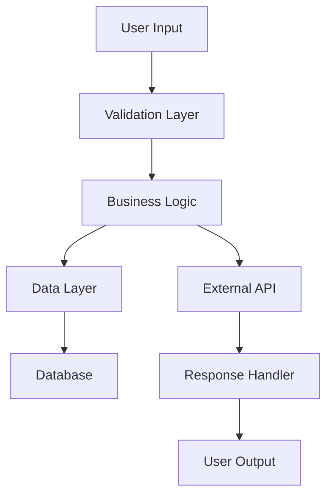

# Brainstorming & Planning Skill

## Purpose

This skill prevents "code-first" mistakes by enforcing a **Planning Phase** that breaks down complex tasks into clear architectural steps, reducing technical debt and rework.

## Triggers

- User requests complex feature implementation
- Task involves multiple components or files
- User says "build", "create system", "architecture"
- New project initialization
- Major refactoring needed
- Integration of new technology or API

## Execution Checklist

### Phase 1: Problem Definition
- [ ] **Clarify Goal**: What exactly needs to be built?
- [ ] **Define Success Criteria**: How do we know it's complete?
- [ ] **Identify Constraints**: Time, technology, dependencies
- [ ] **List Stakeholders**: Who will use this?

### Phase 2: Requirements Gathering
- [ ] **Functional Requirements**: What must it do?
- [ ] **Non-Functional Requirements**: Performance, security, scalability
- [ ] **Edge Cases**: What unusual scenarios must be handled?
- [ ] **Dependencies**: What external systems/APIs are involved?

### Phase 3: Architecture Design
- [ ] **Component Breakdown**: List all major components
- [ ] **Data Flow**: How does information move through the system?
- [ ] **Technology Stack**: What tools/frameworks are needed?
- [ ] **File Structure**: Where will code live?
- [ ] **API Contracts**: Define interfaces between components

### Phase 4: Task Decomposition
- [ ] **Create Task List**: Break into atomic, testable units
- [ ] **Order Dependencies**: What must be built first?
- [ ] **Estimate Complexity**: Mark tasks as simple/medium/complex
- [ ] **Identify Risks**: Where might problems occur?

### Phase 5: Validation
- [ ] **Review with User**: Does plan match expectations?
- [ ] **Check Feasibility**: Can this be built with available resources?
- [ ] **Plan Testing**: How will each component be verified?
- [ ] **Document Plan**: Create `implementation_plan.md` artifact

### Phase 6: Execution Preparation
- [ ] **Setup Environment**: Install dependencies, configure tools
- [ ] **Create Skeleton**: Folder structure, empty files
- [ ] **Write TODOs**: In-code comments for each task
- [ ] **Begin Implementation**: Start with foundational components

## Patterns & Examples

### Pattern 1: Implementation Plan Template

```markdown
# [Feature Name] Implementation Plan

## Goal
[One-line description of what we're building]

## Success Criteria
- [ ] Criterion 1
- [ ] Criterion 2
- [ ] Criterion 3

## Architecture

### Components
1. **Component A**: Does X
2. **Component B**: Does Y
3. **Component C**: Does Z

### Data Flow
```
Input → Component A → Component B → Output
```

### File Structure
```
src/
├── component_a.py
├── component_b.py
└── utils/
    └── helpers.py
```

## Tasks

### Phase 1: Foundation
- [x] Task 1 (simple)
- [x] Task 2 (medium)
- [ ] Task 3 (complex)

### Phase 2: Integration
- [ ] Task 4
- [ ] Task 5

### Phase 3: Testing
- [ ] Unit tests
- [ ] Integration tests
- [ ] Manual validation

## Risks
- Risk 1: [Description] → Mitigation: [Plan]
- Risk 2: [Description] → Mitigation: [Plan]

## Dependencies
- External API: [Name]
- Library: [Name]
- Service: [Name]
```

### Pattern 2: Architecture Mermaid Diagram

```markdown

```

### Pattern 3: Task Breakdown Example

```markdown
## Task: Build Video Generation Dashboard

### Broken Down:
1. **Setup Odyssey Client** (simple)
   - Import SDK
   - Configure API key
   - Test connection

2. **Create UI Layout** (medium)
   - Header with title
   - Input form for prompts
   - Output area for videos
   - Use brand design tokens

3. **Implement Generation Logic** (complex)
   - Handle form submission
   - Call Odyssey API
   - Display loading state
   - Show generated video
   - Handle errors

4. **Add Recording Management** (medium)
   - List previous generations
   - Download functionality
   - Delete functionality

5. **Test & Validate** (simple)
   - Test happy path
   - Test error scenarios
   - Verify UI responsiveness
```

## Anti-Patterns

❌ **DON'T** start coding immediately
```
User: "Build a dashboard"
AI: *Immediately writes 500 lines of code*
```

✅ **DO** plan first
```
User: "Build a dashboard"
AI: "Let me create a plan:
1. What data should it display?
2. Who are the users?
3. What actions can they take?
Let me draft an implementation plan..."
```

❌ **DON'T** skip architecture design
```markdown
## Tasks
- [ ] Build the thing
- [ ] Make it work
```

✅ **DO** define clear architecture
```markdown
## Architecture
- Frontend: React
- Backend: FastAPI
- Database: PostgreSQL
- Deployment: Docker

## Components
1. API Layer
2. Business Logic
3. Data Access Layer
```

❌ **DON'T** create vague tasks
```markdown
- [ ] Implement feature
- [ ] Add functionality
```

✅ **DO** create atomic, testable tasks
```markdown
- [ ] Create `VideoGenerator` class with `generate()` method
- [ ] Add error handling for API timeout
- [ ] Write unit test for prompt validation
```

## Integration

### With Skill Creator
Use this planning process when creating new skills.

### With Brand Design
Include design token setup in architecture planning.

### With Troubleshooting
Plan includes error handling strategy from the start.

### With NotebookLM
Query notebook for architectural patterns before planning.

### With Odyssey ML
- Plan video generation workflows
- Design simulation scripts
- Architecture for batch processing

## Planning Templates

### Quick Plan (< 1 hour task)
```markdown
## Goal: [One line]
## Steps:
1. [Step]
2. [Step]
3. [Step]
## Validation: [How to test]
```

### Medium Plan (1 day - 1 week)
```markdown
## Goal: [Detailed description]
## Architecture: [Components + data flow]
## Tasks: [Broken down by phase]
## Risks: [With mitigations]
## Testing: [Test strategy]
```

### Large Plan (> 1 week)
```markdown
## Goal: [Vision statement]
## Stakeholders: [Who's involved]
## Architecture: [Detailed with diagrams]
## Phases: [Multi-phase breakdown]
## Dependencies: [External + internal]
## Timeline: [Estimates]
## Risks: [With contingencies]
## Success Metrics: [How we measure]
```

## When to Use Each Approach

### Waterfall Planning
- Requirements are clear and stable
- System is well-understood
- Limited opportunity for iteration

### Iterative Planning
- Requirements may evolve
- New technology or API
- User feedback is critical

### Spike Planning
- High uncertainty
- Need to prove concept first
- Research-heavy task

## Validation Questions

Before starting implementation, ask:

1. **Clarity**: Can someone else understand this plan?
2. **Completeness**: Are all components identified?
3. **Feasibility**: Can this be built with available resources?
4. **Testability**: How will we know each part works?
5. **Maintainability**: Will future developers understand this?

## Plan Review Checklist

- [ ] Goal is clear and measurable
- [ ] Architecture diagram included (if complex)
- [ ] All components are identified
- [ ] Data flow is documented
- [ ] Tasks are atomic and ordered
- [ ] Risks are identified with mitigations
- [ ] Testing strategy is defined
- [ ] User approval obtained (for BlockedOnUser artifacts)

---

**Remember**: "Hours of planning save days of debugging."
